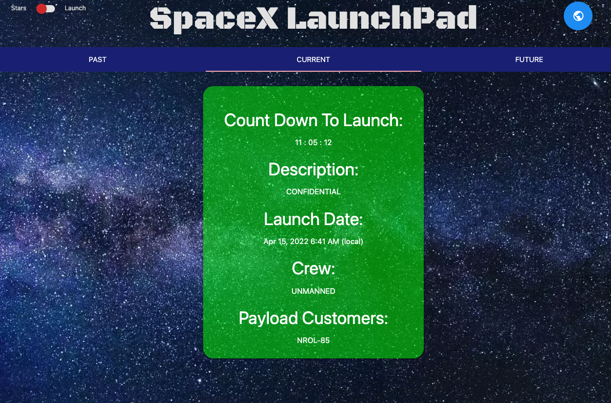
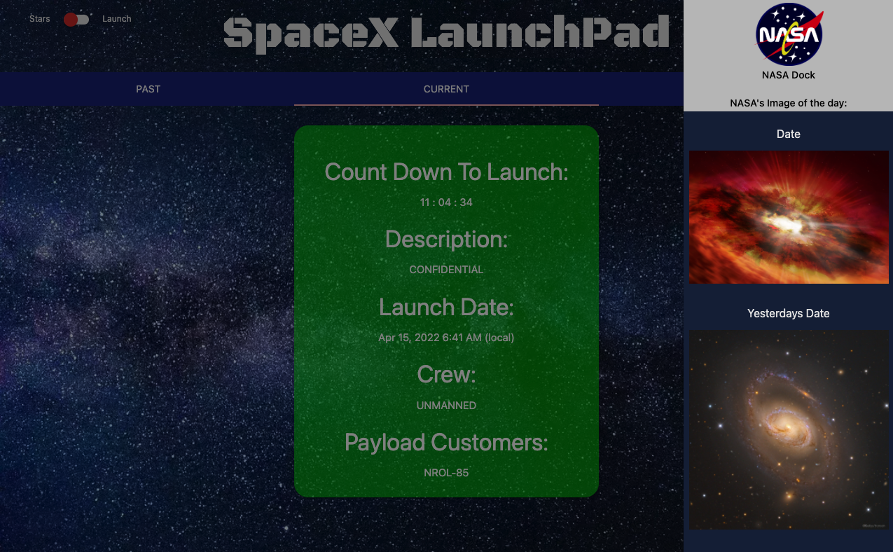
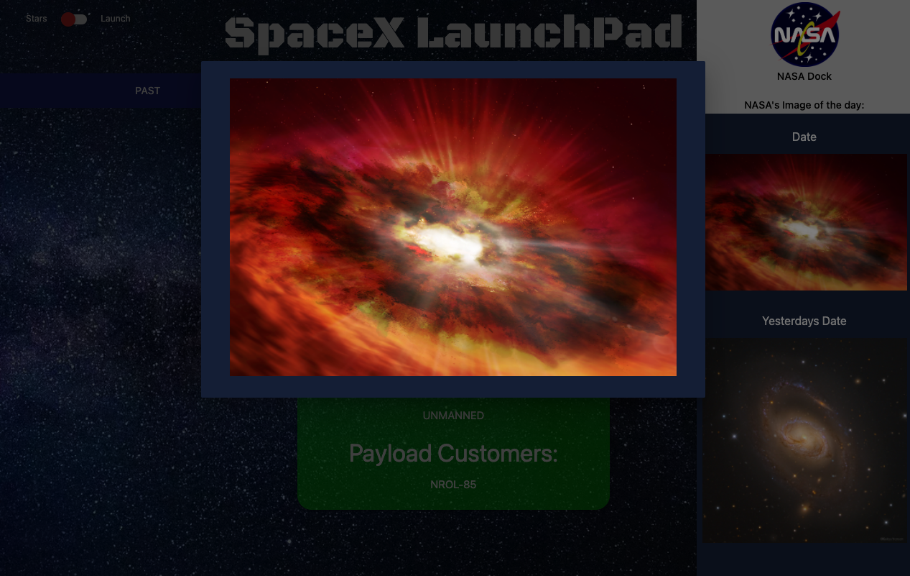

# LaunchPad SpaceX Rocket Watch

## Description
Welcome to the Launchpad SpaceX Rocket Watch! Buckle up because you are in for one hell of a ride! Are you curious about the upcoming SpaceX launch and what they are launching? Then you came to the right place. Enjoy our detailed launch cards with a countdown to the next launch. We provide information for the previous, upcoming and next launches from SpaceX. You will be able to see the crew, launch time, payload and more! That is...if the information is not confidential.

We wanted to be able to provide a sleek dashboard for you to keep up on SpaceX launches and challenge ourselves to deliver a product unlike any we have made so far. I think we have learned a lot as a team and grew as upcoming developers. 

## Deployed Site

https://sammymayhem.github.io/launchpad-gp-1/

## Credits
Principle designers/developers: Jake Kruger, Xing Meng, Phillip Stevenson and Sam Wallace.

API's: SpaceX and NASA Image of the Day

## Screenshots

Homepage

Sidenav

Modal pop out
